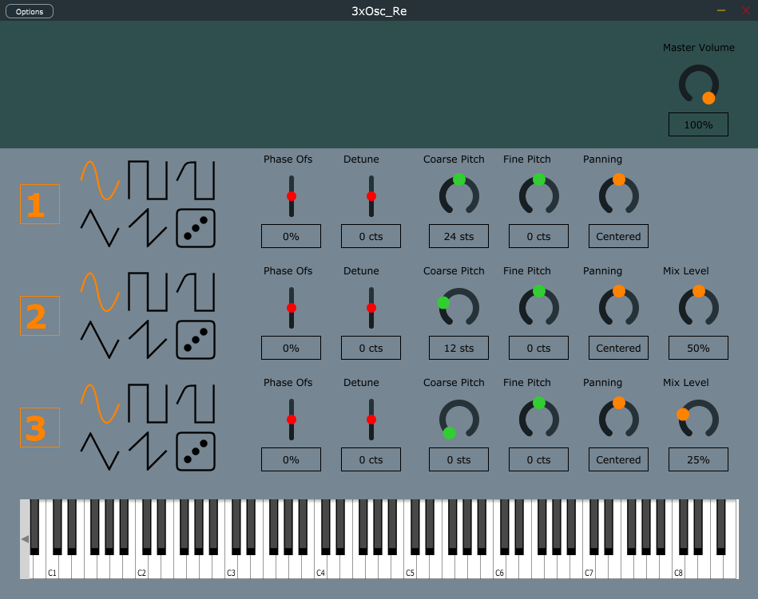

# 3xOsc_Re
 Remake on JUCE of the 3x Osc Plugin from Image-Line

## How to use it

For each oscillator you can control:

- Oscillator Shape -> you can choose amongst 6 oscillator shapes : sine, square, rounded square, triangle, sawtooth and random (white noise).
- Stereo Phase Offset -> allow to get different phase offset for the right and left channel.
- Stereo Detune -> allow to get different tunning between the left and right channel.
- Coarse Pitch Tunning -> change the tunning of the oscillator (-24 to +24 semitones).
- Fine Pitch Tunning -> change the tunning of the oscillator (-100 to +100 cents).
- Stereo Panning -> Set the stereo panning.
- Mixing Level -> Set the mixing level of the second or third oscillator relatively to the first one.

You also have a Master Volume to control the overall amplitude of the synth.

## Video of demonstration

https://youtu.be/y0blEgaHMsQ
